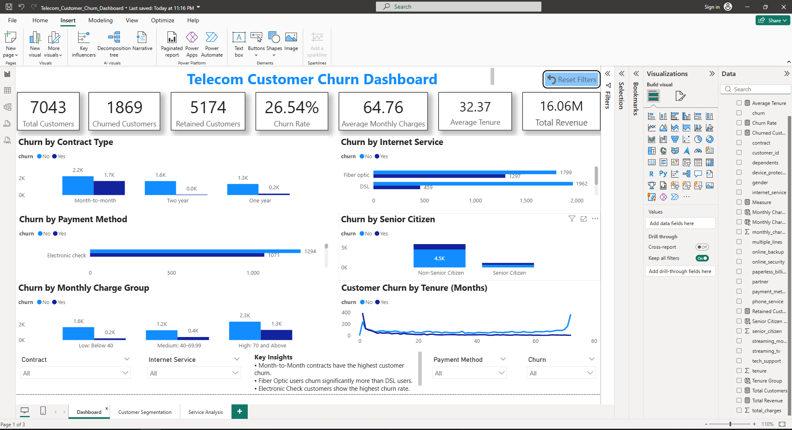
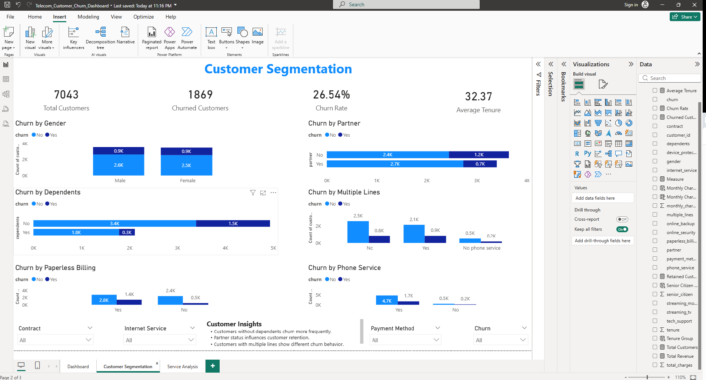
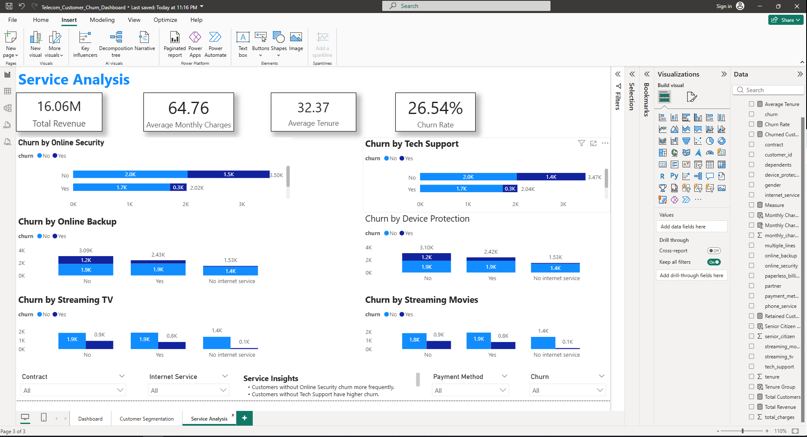

# 📊 Telecom Customer Churn Analysis Dashboard

## 📌 Project Overview

This end-to-end Data Analytics project analyzes customer churn in a telecom company to identify the key factors influencing customer attrition and provide actionable business insights.

The project demonstrates the complete analytics workflow from data cleaning and SQL analysis to interactive Power BI dashboards and business storytelling.

---

## 🎯 Business Problem

Customer churn is one of the biggest challenges faced by telecom companies. Losing existing customers directly impacts revenue and increases customer acquisition costs.

This project answers questions like:

- Which customers are most likely to churn?
- Which services have the highest churn?
- How do contracts affect customer retention?
- Which payment methods are associated with higher churn?
- How do tenure and monthly charges influence churn?

---

# 🛠 Tools & Technologies

- Microsoft Excel
- MySQL
- Power BI
- DAX
- GitHub

---

# 📂 Dataset

**Dataset:** IBM Telecom Customer Churn Dataset

Total Customers: **7,043**

The dataset contains:

- Customer Demographics
- Contract Information
- Internet Services
- Phone Services
- Monthly Charges
- Total Charges
- Payment Method
- Customer Tenure
- Churn Status

---

# 🧹 Data Cleaning

Data cleaning was performed in Microsoft Excel.

Cleaning steps:

- Checked duplicate records
- Handled missing values
- Standardized column names using snake_case
- Corrected data types
- Verified numerical columns
- Prepared data for SQL analysis

---

# 🗄 SQL Analysis

Performed Exploratory Data Analysis using MySQL.

Analysis included:

- Customer distribution
- Churn distribution
- Contract analysis
- Payment Method analysis
- Internet Service analysis
- Senior Citizen analysis
- Gender analysis
- Monthly Charges analysis
- Tenure analysis

---

# 📈 Power BI Dashboard

The dashboard contains **3 interactive pages**.

## Page 1 — Executive Dashboard

Features:

- KPI Cards
- Churn by Contract Type
- Churn by Internet Service
- Churn by Payment Method
- Churn by Senior Citizen
- Monthly Charge Group
- Tenure Distribution
- Interactive Slicers
- Reset Filter Button
- Business Insights

---

## Page 2 — Customer Segmentation

Analysis by:

- Gender
- Partner
- Dependents
- Phone Service
- Multiple Lines
- Paperless Billing

---

## Page 3 — Service Analysis

Analysis by:

- Online Security
- Tech Support
- Device Protection
- Online Backup
- Streaming TV
- Streaming Movies

---

# 📊 Dashboard KPIs

- Total Customers
- Churned Customers
- Retained Customers
- Churn Rate
- Average Monthly Charges
- Average Tenure
- Total Revenue

---

# 📷 Dashboard Preview

## Executive Dashboard



---

## Customer Segmentation



---

## Service Analysis



---

# 💡 Key Insights

- Month-to-Month contract customers have the highest churn.
- Fiber Optic users churn significantly more than DSL customers.
- Electronic Check customers show the highest churn rate.
- Senior Citizens churn more frequently than Non-Senior Citizens.
- Customers without Online Security and Tech Support are much more likely to leave.
- Customers with higher monthly charges tend to churn more often.

---

# 📁 Project Structure

```
Telecom Customer Churn Analysis
│
├── Telecom_Customer_Churn_Dashboard.pbix
├── Telecom_Customer_Churn_Cleaned.xlsx
├── telecom_customer_churn_analysis.sql
├── Executive_Dashboard.png
├── Customer_Segmentation.png
├── Service_Analysis.png
└── README.md
```

---

# 🚀 Skills Demonstrated

- Data Cleaning
- Data Analysis
- SQL
- Power BI
- DAX
- Dashboard Design
- Data Storytelling
- Business Insights
- Data Visualization

---

# 📌 Business Recommendations

- Encourage customers to switch to long-term contracts.
- Improve Fiber Optic service quality.
- Bundle Online Security and Tech Support with internet plans.
- Introduce loyalty offers for Month-to-Month customers.
- Target high-risk customer segments with retention campaigns.

---

# 👨‍💻 Author

**Deepak Yadav**

Aspiring Data Analyst

### Skills

- Excel
- SQL
- Power BI
- Python (Learning)

---

⭐ If you found this project useful, consider giving it a Star.
